<!--
  ┌──────────────────────────────────────────────────────────────┐
  │  Perfil de GitHub — Eddie Elorza                             │
  │  Assets animados generados con: python3 scripts/build_assets.py │
  │  Antes de publicar: bash scripts/personalize.sh <tu-usuario>  │
  └──────────────────────────────────────────────────────────────┘
-->

<picture>
  <source media="(prefers-color-scheme: dark)"  srcset="./assets/hero-dark.svg">
  <source media="(prefers-color-scheme: light)" srcset="./assets/hero-light.svg">
  
</picture>

  
  
  
  

<picture>
  <source media="(prefers-color-scheme: dark)"  srcset="./assets/divider-dark.svg">
  
</picture>

 

## `01` — What I actually do

I take a business problem and carry it all the way to a measurable outcome: discovery, product strategy, architecture, code, instrumentation, iteration. AI is not a feature I bolt on at the end — it is part of how the product works and how I build it.

<picture>
  <source media="(prefers-color-scheme: dark)"  srcset="./assets/pipeline-dark.svg">
  <source media="(prefers-color-scheme: light)" srcset="./assets/pipeline-light.svg">
  
</picture>

 

<table>
<tr>
<td width="33%" valign="top">

### 🤖 &nbsp;AI

`LLM integrations`
`AI agents`
`Agentic workflows`
`RAG & evals`
`Intelligent automation`
`AI-assisted delivery`

</td>
<td width="33%" valign="top">

### 🎯 &nbsp;Product

`Discovery`
`Strategy & positioning`
`MVP definition`
`Roadmapping`
`Product analytics`
`KPI & north-star design`

</td>
<td width="33%" valign="top">

### ⚙️ &nbsp;Engineering

`Frontend architecture`
`React / TypeScript`
`Microfrontends`
`System design`
`API & payments integration`
`Performance budgets`

</td>
</tr>
</table>

<picture>
  <source media="(prefers-color-scheme: dark)"  srcset="./assets/divider-dark.svg">
  
</picture>

 

## `02` — Impact, not responsibilities

<table>
<tr>
<td width="25%" align="center"><h3>6h → 2h</h3>incident cycle time</td>
<td width="25%" align="center"><h3>4</h3>microfrontends owned E2E</td>
<td width="25%" align="center"><h3>6+ yrs</h3>React in fintech</td>
<td width="25%" align="center"><h3>1 monolith</h3>decomposed &amp; shipped</td>
</tr>
</table>

**⚡ Operational automation** — Designed and led an incident-handling flow (SPEI, banca digital, ATM, acquirer errors) that cut a 6+ hour cycle down to ~2 hours, and improved detection before customers noticed.

**🏗️ Architecture migration** — Drove the move from a monolithic WAR frontend to microfrontends: independent deploys, clearer ownership boundaries, no more all-or-nothing releases.

**💳 Payments depth** — 3DS, idempotency, acquirer routing, collections and reconciliation flows. I've owned the frontend on products where a bad deploy is a financial incident.

**🤝 Product partnership** — I work in the seam between Product, UX, Backend, QA and Data, translating technical trade-offs into business consequences and back.

<picture>
  <source media="(prefers-color-scheme: dark)"  srcset="./assets/divider-dark.svg">
  
</picture>

 

## `03` — Stack

**FRONTEND** 
<picture>
  <source media="(prefers-color-scheme: dark)"  srcset="https://skillicons.dev/icons?i=react,ts,js,html,sass,tailwind,nextjs,vue,vite,webpack&theme=dark">
  
</picture>

**BACKEND &amp; DATA** 
<picture>
  <source media="(prefers-color-scheme: dark)"  srcset="https://skillicons.dev/icons?i=python,fastapi,postgres,mysql,supabase,firebase,elasticsearch&theme=dark">
  
</picture>

**PLATFORM &amp; OPS** 
<picture>
  <source media="(prefers-color-scheme: dark)"  srcset="https://skillicons.dev/icons?i=docker,kubernetes,azure,aws,jenkins,githubactions,git,postman&theme=dark">
  
</picture>

**AI &amp; ML** 
<picture>
  <source media="(prefers-color-scheme: dark)"  srcset="https://skillicons.dev/icons?i=pytorch,sklearn&theme=dark">
  
</picture>

**PRODUCT &amp; DESIGN** 
<picture>
  <source media="(prefers-color-scheme: dark)"  srcset="https://skillicons.dev/icons?i=figma,notion,obsidian&theme=dark">
  
</picture>

**TOOLING &amp; PRACTICES**  
<picture>
  <source media="(prefers-color-scheme: dark)"  srcset="./assets/tooling-dark.svg?v=2">
  <source media="(prefers-color-scheme: light)" srcset="./assets/tooling-light.svg?v=2">
  
</picture>

  

<picture>
  <source media="(prefers-color-scheme: dark)"  srcset="./assets/divider-dark.svg">
  
</picture>

 

## `04` — What I'm building

<b>🏨 &nbsp;Hotel Commercial Intelligence Platform</b> &nbsp;<code>active</code>

 

Commercial intelligence for hospitality teams: turns raw sales activity into decisions a revenue manager can act on the same morning.

| | |
|---|---|
| **Surface** | CRM · Analytics · Automation · AI assistance |
| **My role** | Discovery → UX → architecture → build → instrumentation → AI strategy |
| **Stack** | React · TypeScript · Supabase · LLM layer |
| **Hard part** | Making the reporting layer answer *"what should I do next?"*, not just *"what happened?"* |

<b>🍽️ &nbsp;Restaurant Digital Product</b> &nbsp;<code>exploring</code>

 

Digital experiences for restaurants — improving the guest interaction loop and finding the parts worth automating.

| | |
|---|---|
| **Focus** | Product strategy · MVP · customer validation · SaaS |
| **Stage** | Problem validation before a line of production code |

<b>💳 &nbsp;Fintech &amp; Payment Systems</b> &nbsp;<code>day job</code>

 

Financial platforms where reliability, scale, security and customer experience are all non-negotiable at once.

| | |
|---|---|
| **Focus** | Payments · frontend architecture · microfrontends · financial ops |
| **Context** | High-volume, regulated, incident-sensitive |

<picture>
  <source media="(prefers-color-scheme: dark)"  srcset="./assets/divider-dark.svg">
  
</picture>

 

## `05` — Currently sharpening

<picture>
  <source media="(prefers-color-scheme: dark)"  srcset="./assets/focus-dark.svg">
  <source media="(prefers-color-scheme: light)" srcset="./assets/focus-light.svg">
  
</picture>

> Moving from **AI Frontend Engineering → AI Product Engineering**: keeping the technical depth, adding the product and business judgment that decides *what* is worth building.

**Background** — 🎓 MSc Applied Artificial Intelligence (Tec de Monterrey) · 🎓 BSc Information Technology Engineering · 🏆 Professional Scrum Product Owner™ I · ☁️ Azure Fundamentals · 📊 Advanced specializations in AI/ML, Data Science &amp; Data Visualization

<picture>
  <source media="(prefers-color-scheme: dark)"  srcset="./assets/divider-dark.svg">
  
</picture>

 

## `06` — GitHub

<picture>
  <source media="(prefers-color-scheme: dark)"  srcset="./assets/stats-dark.svg?v=2">
  <source media="(prefers-color-scheme: light)" srcset="./assets/stats-light.svg?v=2">
  
</picture>
<picture>
  <source media="(prefers-color-scheme: dark)"  srcset="./assets/langs-dark.svg?v=2">
  <source media="(prefers-color-scheme: light)" srcset="./assets/langs-light.svg?v=2">
  
</picture>

  

<picture>
  <source media="(prefers-color-scheme: dark)"  srcset="./assets/activity-dark.svg?v=2">
  <source media="(prefers-color-scheme: light)" srcset="./assets/activity-light.svg?v=2">
  
</picture>

  

<!-- Snake generado por .github/workflows/snake.yml (rama `output`) -->
<picture>
  <source media="(prefers-color-scheme: dark)"  srcset="https://raw.githubusercontent.com/eddieelorza/eddieelorza/output/snake-dark.svg">
  <source media="(prefers-color-scheme: light)" srcset="https://raw.githubusercontent.com/eddieelorza/eddieelorza/output/snake-light.svg">
  
</picture>

<picture>
  <source media="(prefers-color-scheme: dark)"  srcset="./assets/divider-dark.svg">
  
</picture>

 

### 🤝 &nbsp;Let's build something intelligent

I'm most useful where **AI + engineering + product + business** have to agree with each other.
Open to conversations about AI product roles, architecture work, and automation projects.

  

<code>Mexico City, MX</code> · <code>stats &amp; graphs generated from the GitHub API, not third-party badge services</code>

